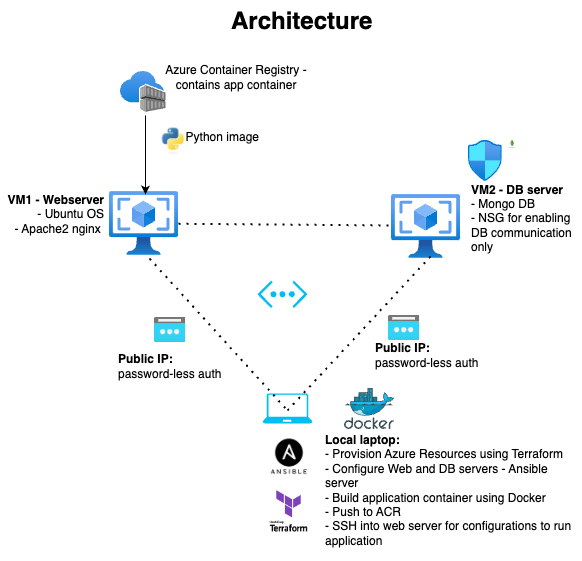

# Terraform-ansible-project
This repo contains scripts for a sample project using Terraform and Ansible

The following items will be accomplished in this simple project:
- Provision 2 Azure VMs of minimal capacity (DSv4-series). This will include creating a VNET and all 2 VMs will be in the same subnet. This provisioning will be done by Terraform
- Out of the 2 configured servers, one would be a web server running apache2. The other server would be a DB Server which would have a mongoDB instance on it. These will be configured by Ansible
- The Ansible "server" will be a local laptop
- Once created, we will then attempt to create a simple collection in the DB on the DB server and try to display the data of this collection on the web server.
- The code to run all the operations will be in Python. The app will be containerized and pushed to Azure Container Registry (Docker Hub can also be used) after which it will be downloaded to the web server and run directly

 

## Steps to run the project:
> Note: I have used the command line for all operations to build and execute this project

 1. Clone the repository as
> `git clone https://github.com/TheIrrationalCoder/Terraform-ansible-project.git`

 2. Install the following on your command line:
- Azure CLI (this also assumes you have a working Azure subscription since all resources will be provisioned in Azure) - installation guide [here](https://learn.microsoft.com/en-us/cli/azure/install-azure-cli)
- Terraform - installation guide [here](https://developer.hashicorp.com/terraform/install)
- Ansible - installation guide [here](https://docs.ansible.com/ansible/latest/installation_guide/intro_installation.html)
- Docker - installation guide [here](https://docs.docker.com/get-docker/)

 3. Ensure you are logged into your Azure account (if not refer to this [document](https://learn.microsoft.com/en-us/cli/azure/authenticate-azure-cli)). Before using Terraform to provision resources in Azure, ensure that Azure allows Terraform to do so. For this, create a Service Principal using the Azure CLI (or through the Portal) and then associate it with Terraform with environment variables. The entire details are provided in the Terraform docs [here](https://registry.terraform.io/providers/hashicorp/azurerm/latest/docs/guides/service_principal_client_secret)

 4. Run the following commands to provision all the required resources for this project.  

>`terraform init` # Initializes TF   

>`terraform plan` # Does a preliminary plan for all TF resources

>`terraform apply` # Creates the resources

 4. Once all resources are provisioned, run `az resource list --location southindia --output table` to see the list of all resources provisioned. Note: Terraform returns the public ip addresses of the web server and db server which may return as blank values. The reason for this is that the public ips may have not been assigned yet to the servers. Running `terraform refresh` will return these values.  
The following resources will be created by Terraform:  
- 1 resource group
- 1 VNET and subnet
- 2 VMs (webserver and dbserver) with OS disks
- NSG for the servers
- public IPs for both servers
- 1 container registry

 5. Copy these values and replace them with the existing values in the `inventory.ini` file under the respective headers `[dbservers]` and `[webservers]` This file will be used as the inventory for Ansible configuration. The `testadmin` user will be used to log in to both these servers to configure them (this user was configured in the previous step by TF during provisioning)

 6. Enable password-less authentication to both servers for allowing Ansible to configure the servers. Follow the steps in this [document](https://medium.com/@prateek.malhotra004/streamlining-secure-remote-access-a-guide-to-passwordless-ssh-connections-between-linux-servers-8c26bb008af9) and repeat the steps for both servers

 7. Run the following commands:  
>`ansible-playbook -i inventory.ini config_dbserver.yaml`    
>`ansible-playbook -i inventory.ini config_webserver.yaml`    

The following will be configured:  
- On the web server, nginx and docker will be installed
- On the db server, mongo db will be installed

 8. Login to the azure container registry by the command `az acr login --name mycontainerRegistryTAProject` 

 9. Build the docker image using `docker build --platform=linux/amd64 -t mycontainerregistrytaproject.azurecr.io/taproject:latest-amd64 .` Validate if the image is created by using `docker images`

 10. Push the image to ACR using `docker push mycontainerregistrytaproject.azurecr.io/taproject:latest-amd64`

 11. SSH into the webserver and download the image from ACR to run it. After logging into the server, use the Service Principal to log into Azure to reach the container registry. Install Azure CLI on the server with the command `curl -sL https://aka.ms/InstallAzureCLIDeb | sudo bash` .   

Login to your azure account with the sample service principal created previosuly. Use the command `az login --service-principal -u <app-id> -p <password-or-cert> --tenant <tenant>` to login. You will have to give contributor access to the service principal for your subscription before the login is successful

 12. Download the image from ACR using `docker pull mycontainerregistrytaproject.azurecr.io/taproject:latest-amd64` Validate if the image was downlaoded using `docker images`

 13. Access the webserver public ip from a browser and the nginx default page should be visible to show it is currently running and accessible. We will now run the docker image to replace the default index.html page. Before that, navigate to the location and remove the default web page:
>`cd /var/www/html`    
>`rm -f index.nginx-debian.html`    

Now, trying to access the webserver should give a 403 forbidden error

 14. Run the docker image using
>`docker run -p 27017:27017 -v /var/www/html:/app/output -it mycontainerregistrytaproject.azurecr.io/taproject:latest-amd64` .   

Depending upon the Linux version of the webserver, the location of the default index file may vary. Check this [document](https://stackoverflow.com/questions/40615678/nginx-index-html-does-not-update-after-modification) if the the server keeps showing the same webpage irrespective of changing it. 

 15. Accessing the webserver should now have a table with a list of users